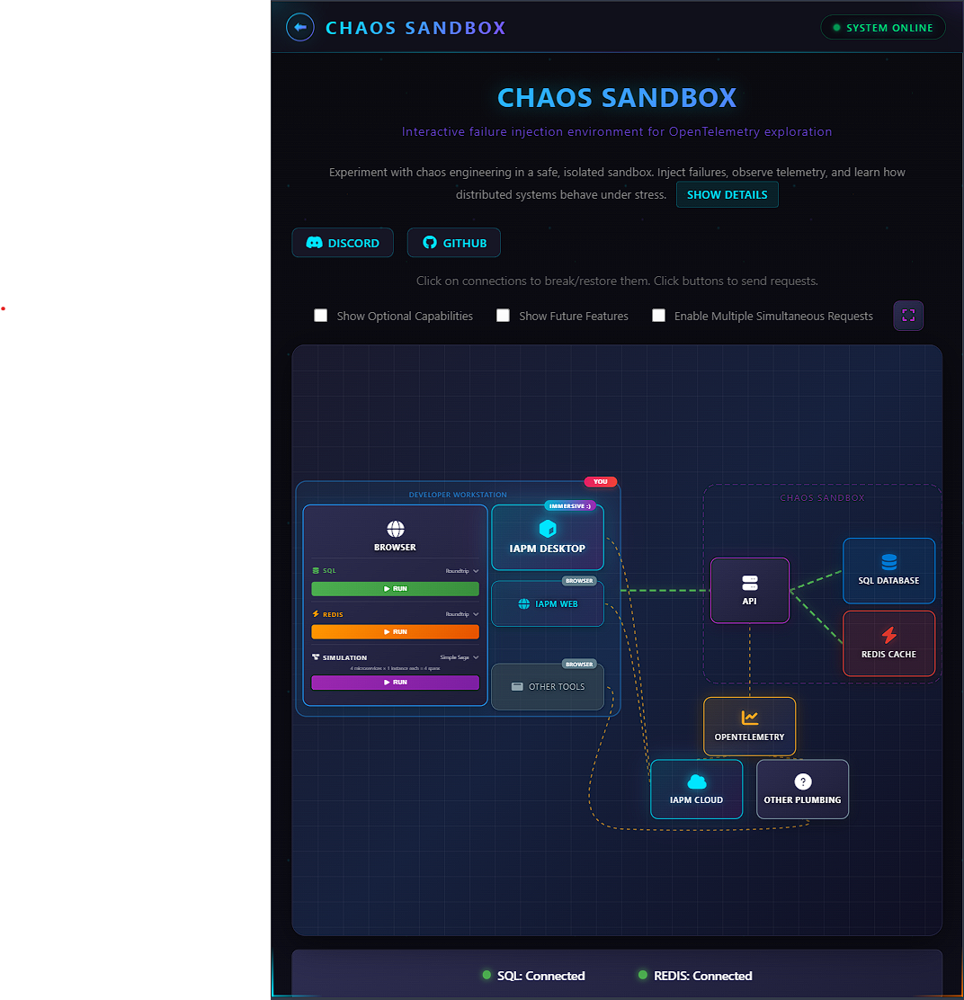

# OpenTelemetry Chaos Simulator Sample

Interactive chaos engineering sandbox for exploring OpenTelemetry with failure injection.



## What is this?

A hands-on Angular/ASP.NET Core application designed for experimenting with chaos engineering and observability. Features an interactive network diagram where you can:

- **Inject failures** - Click connections to break/restore them and observe how failures propagate
- **Send requests** - Trigger SQL or Redis requests and watch animated request flows
- **Observe telemetry** - See how failures affect the telemetry generated by OpenTelemetry
- **Visualize in APM** - View traces, metrics, and logs in Immersive APM

The application is preconfigured with an OpenTelemetry exporter - no code changes or API keys needed.

## Features

- **Interactive Network Diagram** - SVG-based visualization of system components with animated request flows
- **Chaos Injection** - Click connections to break/restore them and observe failure propagation
- **Animated Request Flows** - Watch cyan photon-style dots travel through the request lifecycle (Client → API → Resource → Client)
- **Telemetry Visualization** - Orange animated flows show how telemetry propagates to OpenTelemetry and APM destinations
- **Visual Health Indicators** - Green/red pulsing status indicators show connection health in real-time
- **Futuristic Dark Theme** - Cyberpunk-inspired UI with neon glow effects, glassmorphism, and animated backgrounds
- **CSS-Based Animations** - High-performance pure CSS animations for smooth 60fps visuals
- **Coming Soon** - Message Broker and Worker components for async messaging scenarios

## What this is not

This is not a comprehensive OpenTelemetry demo. For exhaustive OpenTelemetry capabilities, check out the [OpenTelemetry demo](https://github.com/open-telemetry/opentelemetry-demo).

## Recommended Audience

- Developers exploring OpenTelemetry concepts
- Those wanting quick experimentation without local setup
- Anyone curious about observability in distributed systems
- Teams learning how failures appear in APM tools

## What is a sandbox?

When deployed, each user gets an isolated environment to conduct experiments independently. Each sandbox has its own telemetry stream, so your chaos experiments won't affect other users.

## Getting Started

### Live Demo

A demo is deployed at [demo.iapm.app](https://demo.iapm.app/)

**Try it out:**

1. Click connections to break/restore them
2. Click SQL or Redis buttons to send requests
3. Watch the animated request flows
4. Wait 30 seconds for telemetry to appear in APM

**View in Immersive APM:**

- [Microsoft / Azure Account](https://azure.iapm.app/apm/3c4b5e00-c585-4fee-970d-9426b4f6c2db/2075ff0f-2faa-4995-aa06-76648030f440/traces)
- [Local / Social Account](https://my.iapm.app/apm/3c4b5e00-c585-4fee-970d-9426b4f6c2db/2075ff0f-2faa-4995-aa06-76648030f440/traces)

### Connect with us

[Email](info@immersivefusion.com) |
[LinkedIn](https://www.linkedin.com/company/immersivefusion) |
[Discord](https://discord.gg/zevywnQp6K) |
[GitHub](https://github.com/immersivefusion) |
[Twitter / X](https://twitter.com/immersivefusion) |
[YouTube](https://www.youtube.com/@immersivefusion)

[Try Immersive APM](https://immersivefusion.com/landing/default) for your own projects

### Tech Stack

- **Frontend:** Angular 21 with standalone components and CSS-based animations
- **Backend:** ASP.NET Core 9 Minimal APIs
- **Observability:** OpenTelemetry SDK with OTLP exporter
- **Runtime:** Node.js 18+

### Running Locally

**Angular SPA:**

```bash
cd src/Example.Spa
npm install
ng serve -o
```

**ASP.NET API:**

```bash
cd src/Example.Api
dotnet run
```

## Architecture

```
┌─────────┐     ┌─────┐     ┌──────────────┐
│  Client │────▶│ API │────▶│ SQL Database │
└─────────┘     └──┬──┘     └──────────────┘
                   │
                   │        ┌──────────────┐
                   └───────▶│ Redis Cache  │
                   │        └──────────────┘
                   │
                   ▼
            ┌─────────────┐
            │OpenTelemetry│
            └──────┬──────┘
                   │
          ┌────────┴────────┐
          ▼                 ▼
   ┌─────────────┐   ┌───────────┐
   │Immersive APM│   │  Others   │
   └─────────────┘   └───────────┘
```

## Contributing

This sample works with any OpenTelemetry-compatible tool - no proprietary code or libraries.

Feel free to add flows, improve the UI, or extend functionality!

## License

This project is licensed under the MIT License - see the [LICENSE](LICENSE) file for details.

## Acknowledgments

- [OpenTelemetry](https://opentelemetry.io/)
- [Angular](https://angular.dev/)
- [ASP.NET Core Minimal APIs](https://learn.microsoft.com/en-us/aspnet/core/fundamentals/minimal-apis)
- [Immersive Fusion](https://immersivefusion.com/)
