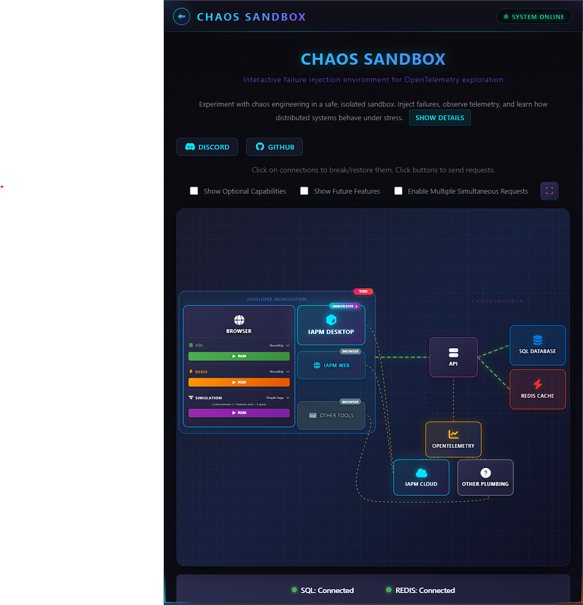

# OpenTelemetry Chaos Simulator

Interactive chaos engineering sandbox for exploring OpenTelemetry observability with failure injection.



## Live Demo

Try it now at **[demo.iapm.app](https://demo.iapm.app/)** - no setup required.

1. Create a sandbox (automatic on first visit)
2. Click connections to inject failures
3. Run SQL/Redis/Pipeline scenarios
4. Watch animated request flows

Want to see traces in 3D? Sign up for a free [Immersive APM](https://www.immersivefusion.com) account.

## What Is This?

A zero-config way to experiment with chaos engineering and observability. The [live demo](https://demo.iapm.app/) requires no setup - just visit the URL and start breaking things. Running locally requires .NET, Node.js, SQL Server, and Redis (see [Running Locally](#running-locally)).

See exactly how failures propagate through distributed systems and appear in APM tools.

## Chaos Scenarios

**SQL Database (5 scenarios)**

| Scenario | What Happens |
|----------|--------------|
| Success | Normal query execution |
| Wrong Table | Query non-existent table |
| Wrong Column | Query non-existent column |
| Syntax Error | Malformed SQL statement |
| Division Error | Division by zero |

**Redis Cache (6 scenarios)**

| Scenario | What Happens |
|----------|--------------|
| Success | Normal SET / DELETE |
| Missing Key | GET non-existent key |
| Large Value | Store 10KB payload |
| Expired Key | Key expires immediately |
| Serialization | Corrupt data detection |
| Invalid Op | Wrong data type operation |

**Pipeline/Saga (2 scenarios)**

| Scenario | What Happens |
|----------|--------------|
| Simple Saga | 4 microservices x 1 instance (4 spans) |
| Multi-Replica | 4 microservices x 2 replicas (8 spans) |

## Features

- **Animated Request Flows** - Cyan photon dots travel Client -> API -> Database -> Client
- **Telemetry Streams** - Orange/blue dots show data flowing to OpenTelemetry and APM
- **Real-time Health** - Green/red pulsing indicators show connection status
- **Click-to-Break** - Inject failures by clicking any connection line
- **Sandbox Isolation** - Each user gets a unique sandbox ID, no interference between sessions

### OpenTelemetry Integration

All three pillars fully instrumented:

```
TRACES   -> AspNetCore, HttpClient, SqlClient, Redis, Custom spans
METRICS  -> Runtime, Process, HTTP request/response metrics
LOGS     -> Structured logging with trace correlation
```

## How It Compares

| Feature | This Simulator | OTel Astronomy Shop | Chaos Mesh + OTel |
|---------|----------------|---------------------|-------------------|
| **Setup Time** | ~2 min (live demo) | ~30 minutes | Hours |
| **Languages** | 2 (C#, TypeScript) | 12+ | Varies |
| **Chaos Built-in** | Yes | No (add-on) | Yes |
| **Visual Learning** | Animated diagram | Static | Dashboard |
| **Target** | Beginners, demos | Intermediate | Production |

## Running Locally

### Prerequisites
- Node.js 20.19, 22.12, or 24+ (required by Angular 21)
- .NET 9 SDK
- Angular CLI (`npm install -g @angular/cli`)
- SQL Server (local or Azure)
- Redis (local or Azure)

### Backend (ASP.NET Core 9) - start first
```bash
cd src/Example.Api
dotnet run
```

### Frontend (Angular 21)
```bash
cd src/Example.Spa
npm install
ng serve -o
```

The frontend opens at `http://localhost:4200` and connects to the API at `http://localhost:5168`.

### Configuration
Edit `src/Example.Api/appsettings.json` with your connection strings and OTLP endpoint. Each connection string has `Open` (working) and `Closed` (broken) values for chaos toggling:
```json
{
  "ConnectionStrings": {
    "Sql": {
      "Closed": "invalid",
      "Open": "Server=localhost;Database=ChaosSimulator;User ID=sa;Password=yourpassword;Encrypt=True;"
    },
    "Redis": {
      "Closed": "invalid",
      "Open": "localhost:6379,abortConnect=False"
    }
  },
  "Otlp": {
    "Endpoint": "https://otlp.iapm.app",
    "ApiKey": "your-api-key"
  }
}
```

> To get an API key, sign up for a free [Immersive APM](https://portal.iapm.app) account.

## Related Tools

- **[OpenTelemetry Trace Generator](https://github.com/ImmersiveFusion/if-opentelemetry-tracegen)** - Single-binary distributed trace generator with 28 services, 59 pods, and 40 scenario flows (including 12 AI agentic scenarios). Zero infrastructure. Complements this simulator: generate topology-rich traces there, inject chaos here, [visualize both in 3D](https://immersivefusion.com).

## Contributing

Contributions welcome - [open an issue](https://github.com/ImmersiveFusion/if-opentelemetry-chaos-simulator-sample/issues) or submit a PR:

- Additional chaos scenarios
- New visualization features
- Alternative APM integrations

## Connect

[Email](mailto:info@immersivefusion.com) |
[LinkedIn](https://www.linkedin.com/company/immersivefusion) |
[Discord](https://discord.gg/zevywnQp6K) |
[GitHub](https://github.com/immersivefusion) |
[Twitter/X](https://twitter.com/immersivefusion) |
[YouTube](https://www.youtube.com/@immersivefusion)

[Try Immersive APM](https://portal.iapm.app) for your own projects.

## License

MIT License - see [LICENSE](LICENSE) for details.

Copyright 2026 [ImmersiveFusion](https://immersivefusion.com)
