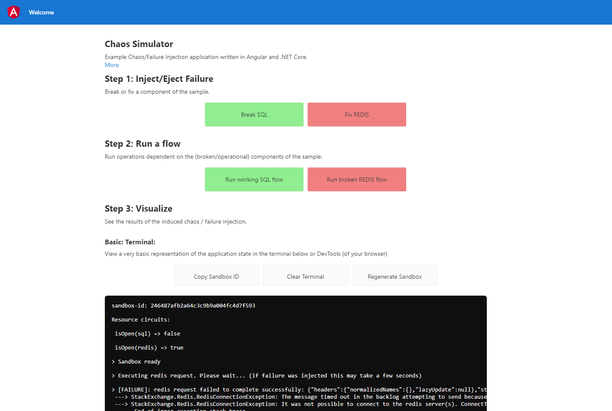

# OpenTelemetry Chaos Simulator Sample

Example Angular and .NET Core application instrumented with OpenTelemetry.



## What is this?
This is a simple Angular/ASP.NET Core application that answers the question "What's the point?". It allows you to inject/eject failures into an application and see how those failures affect the telemetry that is generated. It is already preconfigured with an OpenTelemetry exporter so you don't need to change any code or enter any API keys.

## What this is not
This simple application is not meant to exhaustively show all the capabilities OpenTelemetry. If you are looking for that functionality, check out the [OpenTelemetry demo](https://github.com/open-telemetry/opentelemetry-demo).

## Recommended Audience
* Those interested in but not having much epxerience with OpenTelemetry.
* Those not wanting or having the time to configure or run a full sample application locally or otherwise.
* Those wanting to see how a happy/broken path are showing an APM tool.

## What is sandbox?
When this application is deployed, it has a configured OpenTelemetry exporter. Sandboxing allows users to conduct their own experiments independently without affecting each other.

## Getting Started

### Demo

A demo of the sample is deployed to [demo.iapm.app](https://demo.iapm.app/)

**Immersive APM Web**

Play with the sample. Break things! Then wait 30 seconds and login into the grid using a [Microsoft / Azure Account (NEW!)](https://azure.iapm.app/apm/3c4b5e00-c585-4fee-970d-9426b4f6c2db/2075ff0f-2faa-4995-aa06-76648030f440/traces) or [Local / Social Account](https://my.iapm.app/apm/3c4b5e00-c585-4fee-970d-9426b4f6c2db/2075ff0f-2faa-4995-aa06-76648030f440/traces)

(same grid, just different authentication options)

That's it! Let us know how you like the demo

[Email](info@immersivefusion.com) |
[LinkedIn](https://www.linkedin.com/company/immersivefusion) |
[Mastodon](https://mastodon.social/@immersivefusion) | 
[Twitter / X](https://twitter.com/immersivefusion) |
[YouTube](https://www.youtube.com/@immersivefusion) |
[Facebook](https://www.facebook.com/immersivefusion) |
[Instagram](https://www.instagram.com/immersivefusion) |
[GitHub](https://github.com/immersivefusion) |
[Discord](https://discord.gg/zevywnQp6K)

[Click here](https://immersivefusion.com/landing/default) to try Immersive APM for your own project

### Dependencies

* Angular 17+
* ASP.NET Core 8
* NodeJs

### Installing

There is no additional installation necessary outside of pre-requisite installation to run locally. 

### Executing program

Angular 
```
ng serve -o
```

ASP.NET API
```
dotnet run
```

## Additional examples

### Forwarding traces from the Angular application

This example uses REST post calls to avoid CORS issues sending directly to an OTLP collector on a different domain/port.

You can achieve the same result by following these instructions. 

Add the Immersive APM forwarder

```ps
dotnet add package IF.APM.OpenTelemetry.Forwarder
```
Modify `Program.cs`

```csharp
using IF.APM.OpenTelemetry.Forwarder.Otlp;

void ConfigureForwarder(OtlpTracesForwarderOptions otlpOptions)
{
    otlpOptions.Endpoint = new Uri(builder.Configuration.GetValue<string>("Otlp:Endpoint")!);
    otlpOptions.Headers = new Dictionary<string, string>()
    {
        {
            "Api-Key",
            builder.Configuration.GetValue<string>("Otlp:ApiKey")!
        }
    };
}

builder.Services.AddOtlpTracesForwarder(ConfigureForwarder);
```

Add a controller or mapping to your trace forwarder endpoint

```csharp


app.MapPost("/_tf",
        async ([FromBody] ExportTraceServiceRequest request, ILogger<Program> logger,
            IOtlpTraceForwarder otlpTraceForwarder, CancellationToken cancellationToken) => await otlpTraceForwarder.Forward(request, cancellationToken))
    .WithName("TraceForwarder")
    .WithOpenApi();
```

Add necesarry NPM packages

```ps
npm i @jufab/opentelemetry-angular-interceptor && npm i @opentelemetry/api @opentelemetry/sdk-trace-web @opentelemetry/sdk-trace-base @opentelemetry/core @opentelemetry/semantic-conventions @opentelemetry/resources @opentelemetry/exporter-trace-otlp-http @opentelemetry/exporter-zipkin @opentelemetry/propagator-b3 @opentelemetry/propagator-jaeger @opentelemetry/context-zone-peer-dep @opentelemetry/instrumentation @opentelemetry/instrumentation-document-load @opentelemetry/instrumentation-fetch @opentelemetry/instrumentation-xml-http-request @opentelemetry/propagator-aws-xray --save-dev
```

Modify `environment.ts` to add the `otlpCollectorUrl`

```typescript
export const environment = {
    production: true,
    otlpCollectorUrl: '/_tf',
}
```

Modify `AppModule.ts`

```typescript
import { NgModule } from '@angular/core';
import { BrowserModule } from '@angular/platform-browser';
import {
  HttpClientModule,
  HTTP_INTERCEPTORS,
  HttpClient,
} from "@angular/common/http";

import { AppRoutingModule } from './app-routing.module';
import { AppComponent } from './app.component';
import { SandboxComponent } from './components/sandbox/sandbox.component';

import { SandboxService } from './services/sandbox.service';
import { FlowService } from './services/flow.service';
import { ReplaceLineBreaksPipe } from './pipes/replace-line-breaks.pipe';
import { CompositePropagatorModule, OpenTelemetryInterceptorModule, OtelColExporterModule } from '@jufab/opentelemetry-angular-interceptor';
import { environment } from 'src/environments/environment';


@NgModule({
  declarations: [
    AppComponent,
    SandboxComponent,
    ReplaceLineBreaksPipe
  ],
  imports: [
    BrowserModule,
    HttpClientModule,
    AppRoutingModule,

    OpenTelemetryInterceptorModule.forRoot({
      commonConfig: {
        console: !environment.production,
        production: environment.production,
        serviceName: 'ui', // Service name send in trace
        probabilitySampler: '1',
      },
      otelcolConfig: {
      
        url: environment.otlpCollectorUrl,
        // headers: {
        //   'X-Api-Version': '2.0'
        // }
      },
    }),
    //Insert OtelCol exporter module
    OtelColExporterModule,
    //Insert propagator module
    CompositePropagatorModule
  ],
  providers: [
    SandboxService,
    FlowService,
    ReplaceLineBreaksPipe,
  ],
  bootstrap: [AppComponent]
})
export class AppModule { }

```

## Contributing

This sample can be used with any OpenTelemetry tool. There is not custom code or libraries that are proprietary. 

Please feel free to add flows and improve it if you feel compelled to. 

## License

This project is licensed under the MIT License - see the [LICENSE](LICENSE) file for details

## Acknowledgments

Inspiration, code snippets, etc.
* [OpenTelemetry](https://opentelemetry.io/)
* [Angular default template](https://angular.io/cli/new)
* [ASP.NET Core Minimal APIs](https://learn.microsoft.com/en-us/aspnet/core/fundamentals/minimal-apis)


